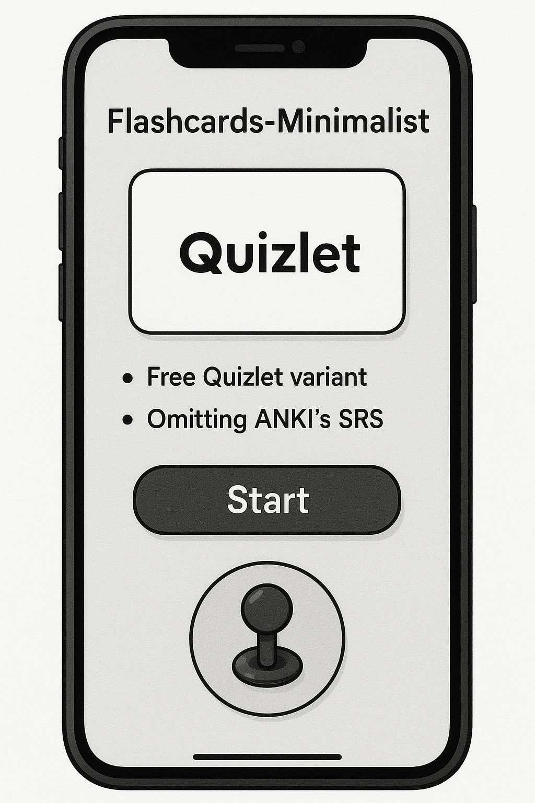

# Flashcards-Minimalist

  

Flashcards-Minimalist is an app simulating Quizlet omitting SRS from ANKI. Use scenarios as follows: 
- (1) Free Quizlet variant
- (2) Omitting ANKI's SRS for specific purpose (e.g. cramming, need to rewise specific information each day...)
- (3) Need for Flashcards-Minimalist app w/o complicated GUI, controllable w/ a joystick

## Advantages
- (1) Usable as Intro to ANKI
- (2) Creating a .txt w/ incorrect answers (as question + answer)
- (3) Controllable w/ a joystick

## TODO
- (1) Input of Q as .jpg (for organic chemistry formulas)
